1) ## With this first query we are checking if DeviceInfo and DeviceLogonEvents tabels are working

union 
    (DeviceInfo | summarize table="DeviceInfo", Rows=count(), Latest=max(Timestamp)),
    (DeviceLogonEvents | summarize table="DeviceLogonEvents", Rows=count(), Latest=max(Timestamp))

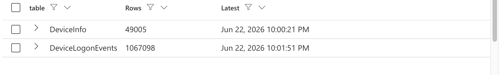

We discovered that Defender logging works, and we have active logs for both tables

2) ## This query instantly identifies which of our servers are exposed to the public internet and ranks them by how severely they are being targeted by automated brute-force attacks.

DeviceLogonEvents
| where TimeGenerated > ago(30d)
| where RemoteIPType == "Public"
| summarize
    Attempts = count(),
    Failure = countif(ActionType == "LogonFailed"),
    Success = countif(ActionType == "LogonSuccess"),
    DistincitSourceIP = dcount(RemoteIP),
    FirstSeen = min(Timestamp),
    LastSeen = max(Timestamp)
    by DeviceName
| order by Failure desc

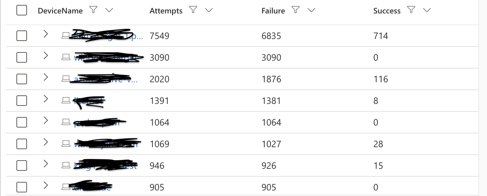
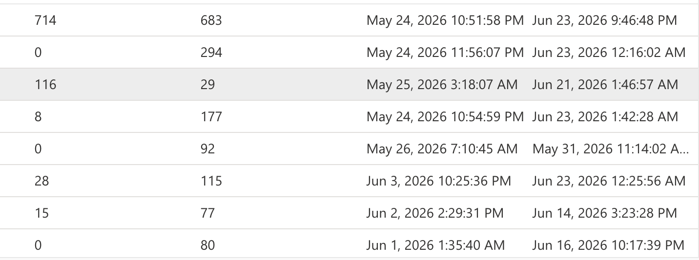

 Out of 484 for VMs that are exposed to the internet we chose top 8 that were getting most attempts,
out of these 8 achine 3 of the had no successful logons. 

3) ## With this query IoAs "Indicators of Attack", It looks for Brute Force and Password spray followed by successful logon from RemoteIP/Public. 

let failures = DeviceLogonEvents
    | where Timestamp > ago(30d)
    | where RemoteIPType == "Public" and ActionType == "LogonFailed"
    | summarize failedcount = count(), firstfail = min(Timestamp), lastfail = max(Timestamp)
     by  DeviceName, RemoteIP, AccountName;
let success = DeviceLogonEvents
    | where Timestamp > ago(30d)
    | where RemoteIPType == "Public" and ActionType == "LogonSuccess"
    | project DeviceName, RemoteIP, AccountName, Succeesstime = Timestamp, LogonType;
failures
| join kind=inner success on DeviceName, RemoteIP, AccountName
| where Succeesstime between (firstfail ..(lastfail + 1h))
| where failedcount > 10
| project DeviceName, RemoteIP, AccountName, failedcount, firstfail, lastfail, Succeesstime, LogonType
| order by failedcount

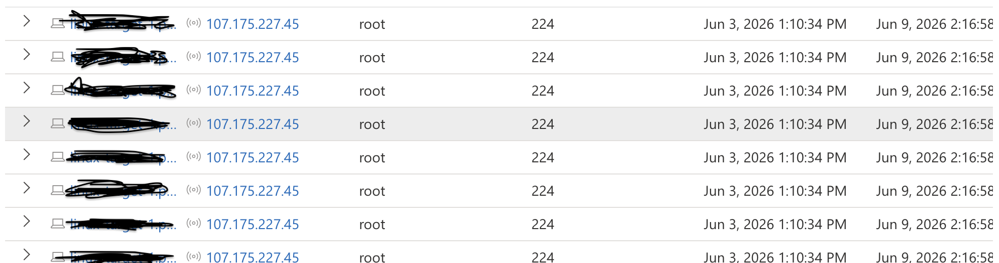
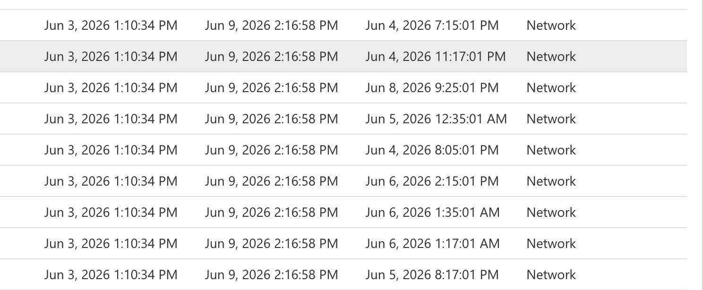

These results show that we indeed have brute force attacks followed by successful logons. out of many VMs that has been victims of brute force attack I choose 2 of the most attacked machines.

4) ## This query specificaly looks for LoL "Living Off the Land" attack indicators, and suspicious activities that can be indicator for alteral movment.

let attackerIP = "107.175.227.45";
let compromisedMachines = DeviceLogonEvents
    | where TimeGenerated > ago(30d)
    | where RemoteIP == attackerIP
    | where ActionType == "LogonSuccess"
    | distinct DeviceName;
let FirstLogin = toscalar(
    DeviceLogonEvents
    | where TimeGenerated > ago(30d)
    | where RemoteIP == attackerIP
    | where ActionType == "LogonSuccess"
    | summarize min(TimeGenerated)
);
let LastLogin = toscalar(
    DeviceLogonEvents
    | where TimeGenerated > ago(30d)
    | where RemoteIP == attackerIP
    | where ActionType == "LogonSuccess"
    | summarize max(TimeGenerated)
);
DeviceProcessEvents
| where TimeGenerated > ago(30d)
| where DeviceName in (compromisedMachines)
| where TimeGenerated between (FirstLogin .. (LastLogin + 4h)) // Added a 4-hour buffer after their final login just in case
| where ProcessCommandLine has_any (
    "wget", "curl", "chmod", "chown", "useradd", "adduser", "usermod", "passwd",
    "ssh-keygen", "authorized_keys", ".ssh", "crontab", "/tmp/", "/dev/shm",
    "base64", "ncat", "netcat", "nc ", "bash -i", "python -c", "perl -e",
    "/etc/passwd", "/etc/shadow", "sudo", "apt install", "systemctl", "wget http")
| project ProcessTime = TimeGenerated, DeviceName, ProcAccount = AccountName,
          FileName, ProcessCommandLine, InitiatingProcessCommandLine
| order by ProcessTime asc

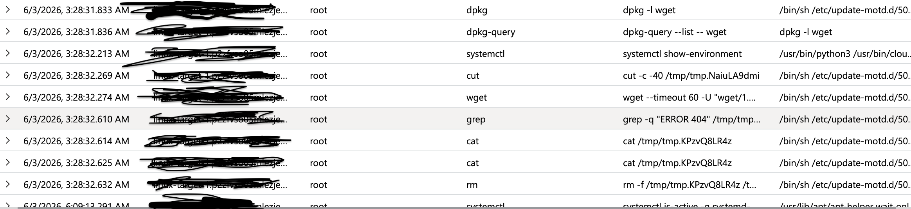

I did not find any suspicious commands coming from an attacker on this specific RemoteIP. But after running the same query for second RemoteIP I found suspicious commands, Attacker installed SMB and VFT spaced over 2 minutes, they used sudo escalated to root user.

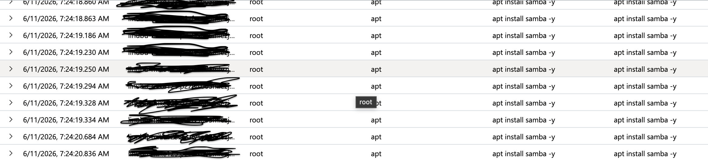
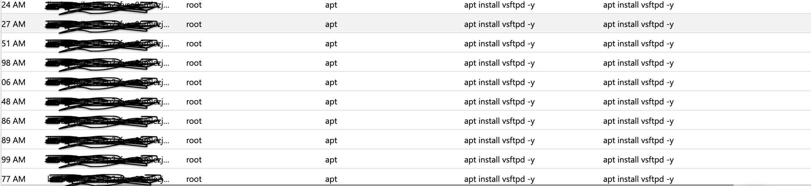
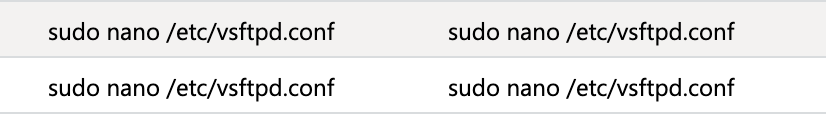

5) ## With next query I want to make sure that LabUser account was hijecked by unfamilliar RemoteIP.

DeviceLogonEvents
| where DeviceName has "*************"
| where TimeGenerated > ago(30d)
| where AccountName has "labuser"
| where ActionType == "LogonSuccess"
| project TimeGenerated, LogonType, RemoteIP, RemoteIPType, LogonId
| order by TimeGenerated asc

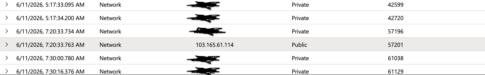

After running this query we see that timestamps match with eachother, attacker escalated privileges from Labuser to rootuser and in less then 10 min period installed netwroking technologies to share and store files.

6) ## With this query I am double checking by manual deep diving that this VM has been compomised.

DeviceProcessEvents
| where DeviceName has "******"
| where TimeGenerated between (datetime(2026-06-11T07:20:00Z) .. datetime(2026-06-11T08:00:00Z))
| project TimeGenerated, AccountName, LogonId, ProcessCommandLine, InitiatingProcessCommandLine
| order by TimeGenerated asc

This step proved same commands and activities in same time perioed.

7) ## Having found that attacker compromised and installed SMB and FTP this query checks whether those channels were ever used. The filter deliberately catches two cases:

  1. any connection to/from the attacker IP `103.165.61.114` on any port
     (potential C2 or exfiltration), and
  2. any traffic on the FTP/SMB service ports 21, 445, 139 from any source
     (use of the installed services)

DeviceNetworkEvents
| where DeviceName has "*****"
| where TimeGenerated between (datetime(2026-06-11T07:20:00Z) .. datetime(2026-06-11T12:00:00Z))
| where RemoteIP == "103.165.61.114" or RemotePort in (21, 445, 139)
| project TimeGenerated, ActionType, RemoteIP, RemotePort, InitiatingProcessFileName
| order by TimeGenerated asc

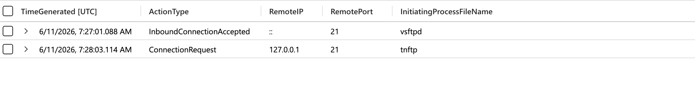

Network telemetry shows vsftpd listening on port 21 and a local self-test from 127.0.0.1 via tnftp confirming the attacker built and validated an FTP channel. However, no public or attacker-sourced (103.165.61.114) connection ever reached ports 21/445/139. The exfiltration channel was prepared but not used externally.

8) ## With next query we specificaly search for not private connections made from Public RemoteIP to our private netwrok Inboundconnections on SMB and FTP or on RemotePorts.

DeviceNetworkEvents
| where DeviceName has "******"
| where TimeGenerated > datetime('2026-06-11T07:00:00Z')
| where RemotePort in (21, 20, 445, 139)
| where ActionType in ("InboundConnectionAccepted", "ConnectionSuccess")
| extend isPublic = not(ipv4_is_private(RemoteIP))
| where isPublic and RemoteIP !="::"
| project TimeGenerated, ActionType, RemoteIP, RemotePort, InitiatingProcessFileName
| order by TimeGenerated asc

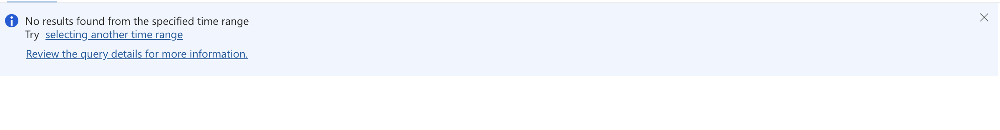

We have no Inbound connections on this VM.

9) ## With this next query I am looking for lateral movement, I want to see if there has been private outbound private conenctions from this VM to otehr VMs on our private network.

let victimIPs =
    DeviceNetworkEvents
    | where DeviceName has_any ("******", "*******")
    | where isnotempty(LocalIP)
    | distinct LocalIP;
DeviceLogonEvents
| where TimeGenerated > datetime(2026-06-01T00:00:00Z)
| where ActionType == "LogonSuccess"
| where RemoteIP in (victimIPs)                      
| where not(DeviceName has_any ("******", "******"))
| project TimeGenerated, DeviceName, AccountName, LogonType, RemoteIP
| order by TimeGenerated asc

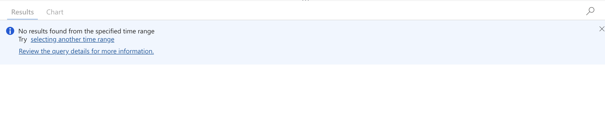

After running this query we don't see lateral movement, no out going connections on private network (Other VMs) from out compromised machines.

10) ## With these queries I am looking for the cause of activity cessation, After confirming the attacker staged FTP/SMB services but did not exfiltrate data, the objective of this phase was to establish why the activity stopped. I am checking for Isolation, Firewall rules blocking activity, antivirus activities and so on.

DeviceEvents
| where DeviceName has "*****"
| where TimeGenerated > datetime('2026-06-11T07:00:00Z')
| project ActionType, RemoteIP, ProcessCommandLine, InitiatingProcessCommandLine, AdditionalFields, TimeGenerated, FileName
| order by TimeGenerated asc

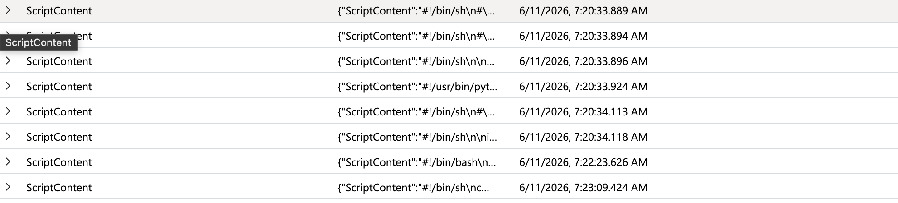

union withsource=Tbl DeviceProcessEvents, DeviceNetworkEvents, DeviceLogonEvents, DeviceEvents
| where DeviceName has "*****"
| where TimeGenerated between (datetime(2026-06-11T07:20:00Z) .. datetime(2026-06-11T12:00:00Z)) 
| summarize Events=count() by bin(TimeGenerated, 10m)
| order by TimeGenerated asc

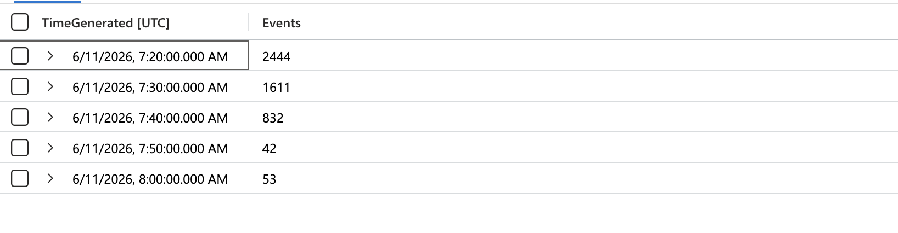

DeviceNetworkEvents
| where DeviceName has "*****"
| where TimeGenerated > datetime(2026-06-11T07:25:00Z)
| summarize Connections=count() by bin(TimeGenerated, 1m)
| order by TimeGenerated asc

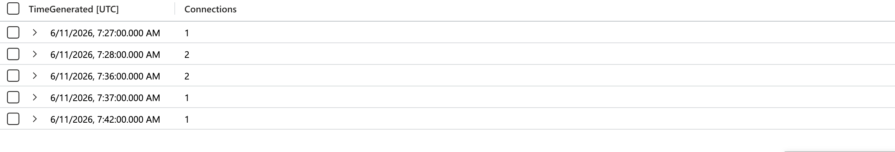

DeviceInfo
| where DeviceName has "*****"
| where TimeGenerated > ago(40d)
| summarize by bin(TimeGenerated, 1h), PublicIP, OnboardingStatus
| order by TimeGenerated asc

After running this queries there is no evidence that something stopped the attacker from using networking services that they installed on the machine, we can assume that they can come back anytime and they arewaiting for right time.

This IP address has been reported on AbuseIPdb 36 times and we can confidently say that we are dealing with malicious actor.

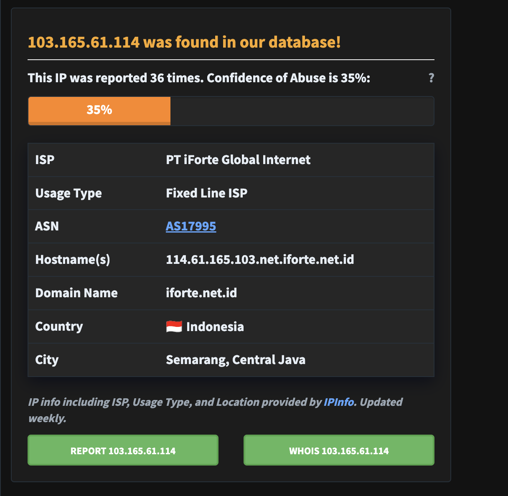

11) ## Remediation and Response

 Becasue the investigation found **no containment occured** the host remains exposed, the compromised credintials were never changed and the attacker installed services are still active, remediation is a hight proprity. The actor staged for a likely return, so the goal is to close every possible path. Contain → Eradicate → Recover → Harden.

 - Isolate the machine in microsoft defender
 - Reset/Disable the "labuser" and "Root" accounts, revoke active sessions and ssh keys.
 - Block attackers IP "103.165.61.114" at the perimeter and as defenders custom indicators.
 - Remove attackers installed services `apt purge vsftpd samba` and delete the
  modified `/etc/samba/smb.conf` and the `ftp` service account if unused.
 - Hunt for additional presistence before declaring the host clean, entires, new users, modified startup scripts, cron jobs,
  `~/.ssh/authorized_keys
 - Given root level compromise rebuild it from the known good image.
 - Remove the public exposure, reassign to a private IP / restrict the NSG so only management ranges can reach SSH; close ports 21, 445, and 139 to the internet.
 - Restore any legitimately needed services from clean configuration and validate
 - Enforce account lockout or fail2ban on hosts. The root cause of he successful brute force
 - Disable SSH password authentication. require key based auth + MFA, disable direct root ssh.
 - Operationalize detection: convert the brute-force IoA query (Section 3) into a
  scheduled analytics rule, and alert on service installs (vsftpd/samba) on
  servers that shouldn't run them.

  

